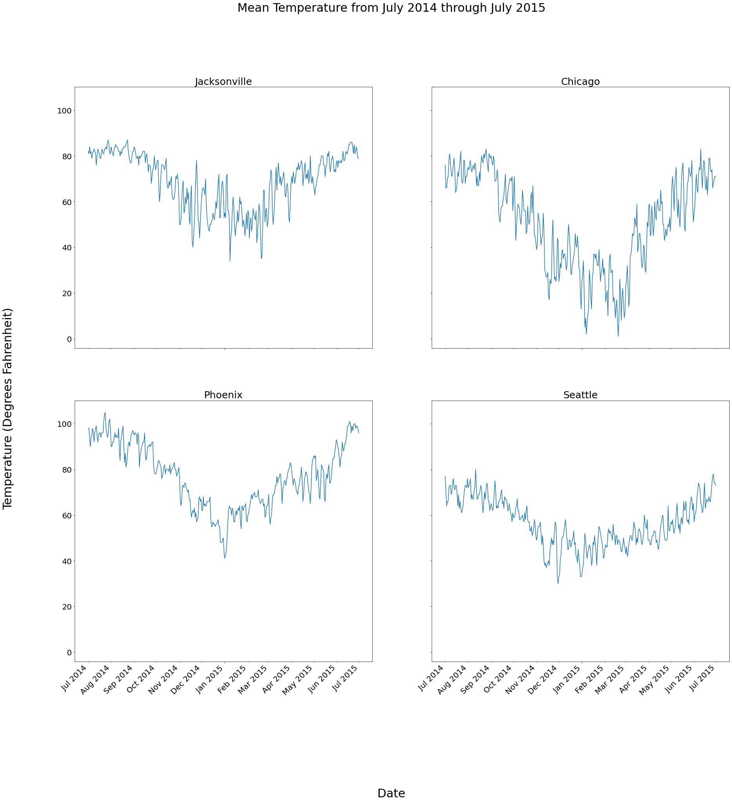
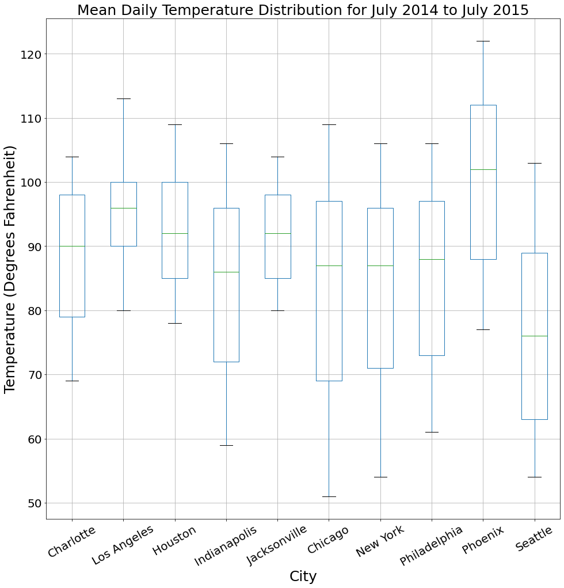
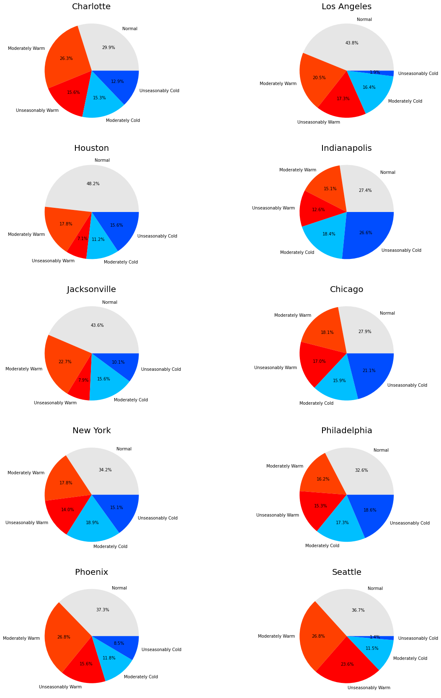

This repository contains analysis of weather data for 10 U.S. cities from July 1st 2014 to June 30th 2015. The dataset (which can be found here: https://github.com/fivethirtyeight/data/tree/master/us-weather-history) contains daily and historical temperature and precipitation information. 

The python files in this repository can be used to recreate the visualizations displayed in this readme. Simply run: "python create_visualizations.py" to create the images and save them in the images folder. Required dependencies are: Matplotlib and Pandas.

<h1>The Analysis</h1>

I began my analysis by loading the data into pandas dataframes, one for each city. The data required very little cleaning, I just checked the dataframes for null values and converted the date column into a pandas datetime format for easy manipulation. I began my analysis by simply plotting the mean daily temperatures for several cities. This is shown in the following figure for Jacksonville, Chicago, Phoenix, and Seattle.


```python
import pandas as pd
import seaborn as sns
import os
import re
import numpy as np
import matplotlib.pyplot as plt
import matplotlib.dates as mdates
%matplotlib inline

# the name of the folder where the data is stored
data_folder = 'data'

cities = dict()
cities['Charlotte'] = pd.read_csv(os.path.join(data_folder, 'KCLT.csv'), parse_dates=["date"])
cities['Los Angeles'] = pd.read_csv(os.path.join(data_folder, 'KCQT.csv'), parse_dates=["date"])
cities['Houston'] = pd.read_csv(os.path.join(data_folder, 'KHOU.csv'), parse_dates=["date"])
cities['Indianapolis'] = pd.read_csv(os.path.join(data_folder, 'KIND.csv'), parse_dates=["date"])
cities['Jacksonville'] = pd.read_csv(os.path.join(data_folder, 'KJAX.csv'), parse_dates=["date"])
cities['Chicago'] = pd.read_csv(os.path.join(data_folder, 'KMDW.csv'), parse_dates=["date"])
cities['New York'] = pd.read_csv(os.path.join(data_folder, 'KNYC.csv'), parse_dates=["date"])
cities['Philadelphia'] = pd.read_csv(os.path.join(data_folder, 'KPHL.csv'), parse_dates=["date"])
cities['Phoenix'] = pd.read_csv(os.path.join(data_folder, 'KPHX.csv'), parse_dates=["date"])
cities['Seattle'] = pd.read_csv(os.path.join(data_folder, 'KSEA.csv'), parse_dates=["date"])
```


```python
mean_temps = pd.DataFrame()
for city in cities.keys():
    mean_temps[city] = pd.Series(cities[city]['actual_mean_temp'].values)
mean_temps['date'] = cities[city]['date']
```


```python
years = mdates.YearLocator()   # every year
months = mdates.MonthLocator()  # every month
month_fmt = mdates.DateFormatter('%b %Y')
years_fmt = mdates.DateFormatter('%b %Y')

length = 2
height = 2

fig, axes = plt.subplots(height, length, figsize=(30, 30), sharey=True)

count = 0
for city in ['Jacksonville', 'Chicago', 'Phoenix', 'Seattle']:
    ax = axes[count // length, count % length]
    ax.plot(mean_temps['date'], mean_temps[city])
    ax.set_title(city, size=25)
    ax.xaxis.set_major_locator(years)
    ax.xaxis.set_major_formatter(years_fmt)
    ax.xaxis.set_minor_locator(months)
    ax.xaxis.set_minor_formatter(month_fmt)
    for tick in ax.xaxis.get_major_ticks():
        tick.label.set_fontsize(20) 
    for tick in ax.xaxis.get_minor_ticks():
        tick.label.set_fontsize(20) 
    for tick in ax.yaxis.get_major_ticks():
        tick.label.set_fontsize(20)         

        # specify integer or one of preset strings, e.g.
        #tick.label.set_fontsize('x-small') 
#         tick.label.set_rotation('vertical')
    count += 1
    if count == 4:
        break

# plt.xticks(fontsize=20)
plt.suptitle('Mean Temperature from July 2014 through July 2015', fontsize=30)
fig.text(0.5, 0.04, 'Date', ha='center', fontsize=30)
fig.text(0.04, 0.5, 'Temperature (Degrees Fahrenheit)', va='center', rotation='vertical', fontsize=30)

fig.autofmt_xdate(rotation=45, which='minor')
fig.autofmt_xdate(rotation=45, which='major')
```


    

    


As one would expect, the temperatures vary alot from city to city, but each curve has the same basic V shape with the central dip around January. To further investigate the variability, we can look at box plots for these same 4 cities.


```python
length = 2
height = 2

mean_temps.boxplot(fontsize=20, figsize=(16,16), rot=30)
plt.title('Mean Daily Temperature Distribution for July 2014 to July 2015', size=25)
plt.xlabel('City', size=25)
plt.ylabel('Temperature (Degrees Fahrenheit)', size=25)
```


    Text(0, 0.5, 'Temperature (Degrees Fahrenheit)')


    

    


This shows that some cities like Chicago and Seattle have much more weather variability throughout the year than cities like Jacksonville and Los Angeles. Given the large differences between cities, it's better to compare each city's current data to its own historical data than to any other city's. With this in mind, I wanted to find out if these data show a warming trend (as one would expect due to climate change). 

For each day, the dataset contains the average maximum temperature on that day since 1880 and the actual maximum temperature that occurred. I subtracted the former from the latter to calculate the daily maximum temperature's deviation from the historical average maximum temperature. If this shows a large number of positive deviations (the actual maximum temperature is larger than the histoirical average) then this indicates a warming trend and likewise a large number of negative deviations (the historical average is larger than the actual maximum temperature) indicates a cooling trend. 

To visualize this I took the deviations and classified them as:<br>
   &nbsp; "Normal" if the deviation was between 3 and -3, <br>
   &nbsp; "Moderately Warm" if between 8 and 3, <br>
   &nbsp; "Moderately Cold" if between -8 and -3, <br>
   &nbsp; "Unseasonably Warm" if greater than 8, and <br>
   &nbsp; "Unseasonably Cold" if less than -8 

For each of the 10 cities in the dataset I created pie charts showing the percent of days falling into each of these 5 classes. Shown in the following figure. 


```python
def calculate_deviation(df):
    df['max_temp_deviation'] = df['actual_max_temp'] - df['average_max_temp'] 

def classify_deviation(df):
    classes = []
    
    for index, row in df.iterrows():
        d = row['max_temp_deviation']
        if d <= 3 and d >= -3:
            classes.append('Normal')
        elif d <= 8 and d > 3:
            classes.append('Moderately Warm')
        elif d >= -8 and d < -3:
            classes.append('Moderately Cold')
        elif d > 8:
            classes.append('Unseasonably Warm')
        elif d < -8:
            classes.append('Unseasonably Cold')

    df['max_temp_deviation_class'] = classes
    
    
for city in cities.keys():
    calculate_deviation(cities[city])
    classify_deviation(cities[city])
```


```python
length = 2
height = 5

fig, axes = plt.subplots(height, length, figsize=(20, 30))
color_map = {
    'Normal': (0.9, 0.9, 0.9),
    'Moderately Warm': (1.0, 0.25, 0),
    'Unseasonably Warm': (1.0, 0, 0),
    'Moderately Cold': (0, 0.75, 1.0),
    'Unseasonably Cold': (0, 0.3, 1.0)
}

count = 0
for city in cities.keys():
    ax = axes[count // length, count % length]
    
    value_counts = cities[city]['max_temp_deviation_class'].value_counts()
    labels = ['Normal', 'Moderately Warm', 'Unseasonably Warm', 'Moderately Cold', 'Unseasonably Cold']
    sizes = [(value_counts[label] / 365) for label in labels]
    colors = [color_map[label] for label in labels]
    
    ax.set_title(city, size=20)
    ax.pie(sizes, labels=labels, autopct='%1.1f%%', colors=colors)
    
    count += 1
    
plt.savefig('pie_plots.png', facecolor='white')
plt.show()
```

    <ipython-input-65-28540dd941f5>:23: MatplotlibDeprecationWarning: normalize=None does not normalize if the sum is less than 1 but this behavior is deprecated since 3.3 until two minor releases later. After the deprecation period the default value will be normalize=True. To prevent normalization pass normalize=False 
      ax.pie(sizes, labels=labels, autopct='%1.1f%%', colors=colors)
    


    

    


These charts show less warming than I would have expected. New York, Philadelphia, Chicago, and Houston show roughly equal percentages of warm and cool days and Indianapolis even showed a substantially cooler year than average. However Seattle, Phoenix, Jacksonville, Charlotte, and Los Angeles show quite severe heat trends.


```python

```
